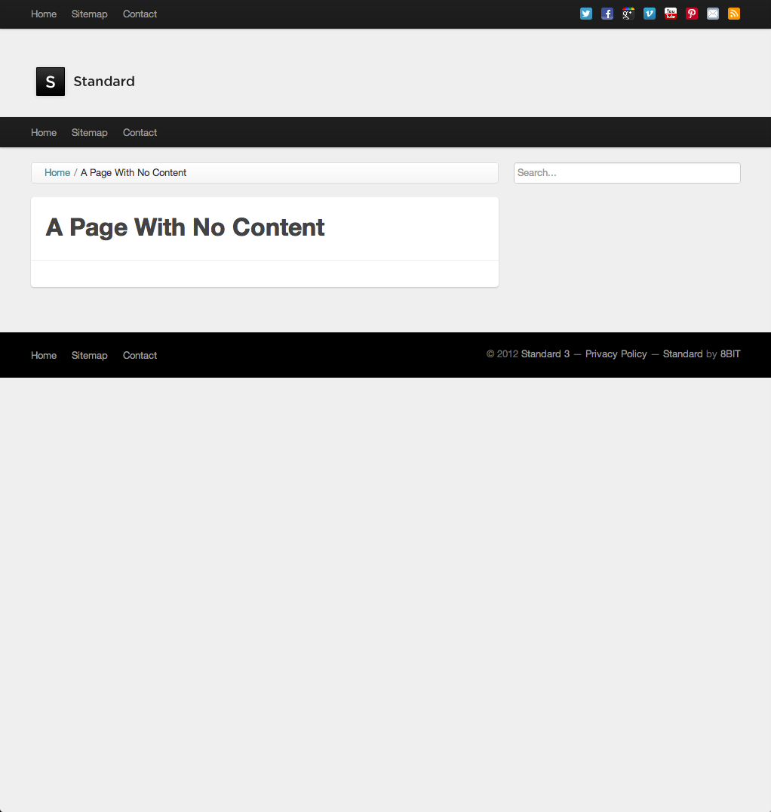
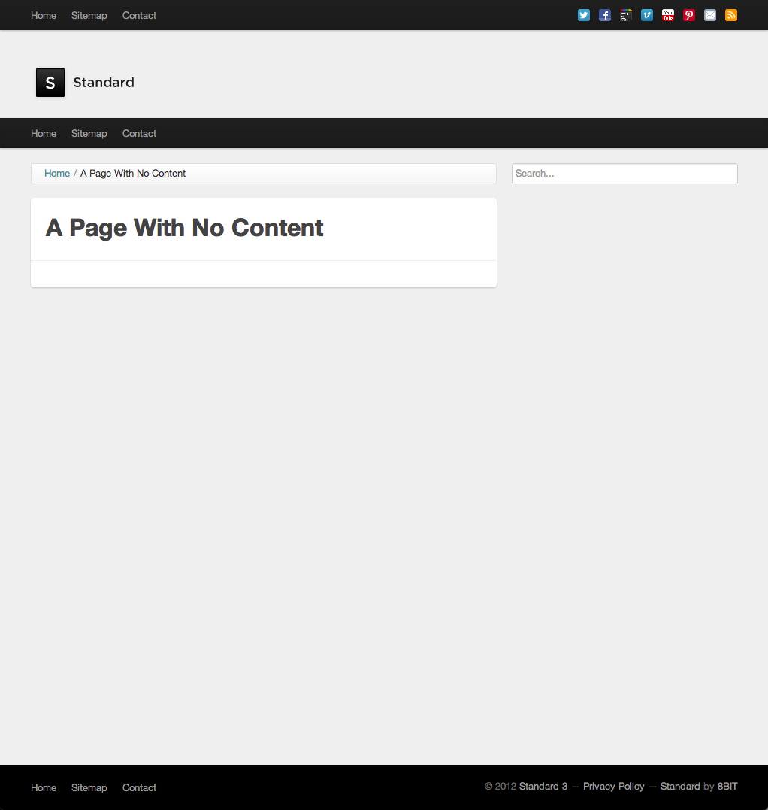

# Standard Sticky Footer

## Description

Forces the footer to stick the bottom of the browser window, if there is not enough content to fill the screen.

**Before**:



**After**:



## Installation

There are two ways to install WordPress plugins: via the WordPress Dashboard (recommended) and via FTP. 

*Installing via the WordPress Dashboard is recommended because this process makes sure all the file and folder permissions are set correctly.*

### Using the WordPress Dashboard

1. Download the [plugins](https://github.com/eightbit/plugins/zipball/master).
2. Unzip the ```eightbit-plugins.zip``` archive on your computer.
3. Locate the ```standard-sticky-footer``` directory within the ```eightbit-plugins``` directory.
4. Rezip the ```standard-sticky-footer``` directory.
5. Locate the **Plugins** menu.
6. In the **Plugins** menu, click on **Add New**.
7. On the **Add New** page, click on the **Upload** link at the top of the page.
8. On the **Upload** page, locate the ```standard-sticky-footer.zip``` archive (zip) on your computer (created in Step #4) and click **Install Now**.
9. On the successful upload page, click **Activate**.

### Using FTP

1. Download the [plugins](https://github.com/eightbit/plugins/zipball/master).
2. Unzip the ```eightbit-plugins.zip``` archive on your computer.
3. Locate the ```standard-sticky-footer``` directory within the ```eightbit-plugins``` directory.
4. Connect to your server via FTP.
5. Upload the ```standard-sticky-footer``` directory to the ```/wp-content/plugins/``` directory on your server.
6. In the WordPress Dashboard, navigate to the **Installed Plugins** page under the **Plugins** menu.
7. Locate **Standard Sticky Footer** and click **Activate**.

## Credit

* [Michael Novotny](http://manovotny.com)

## License

* [GPL](http://www.gnu.org/licenses/gpl-3.0.html)